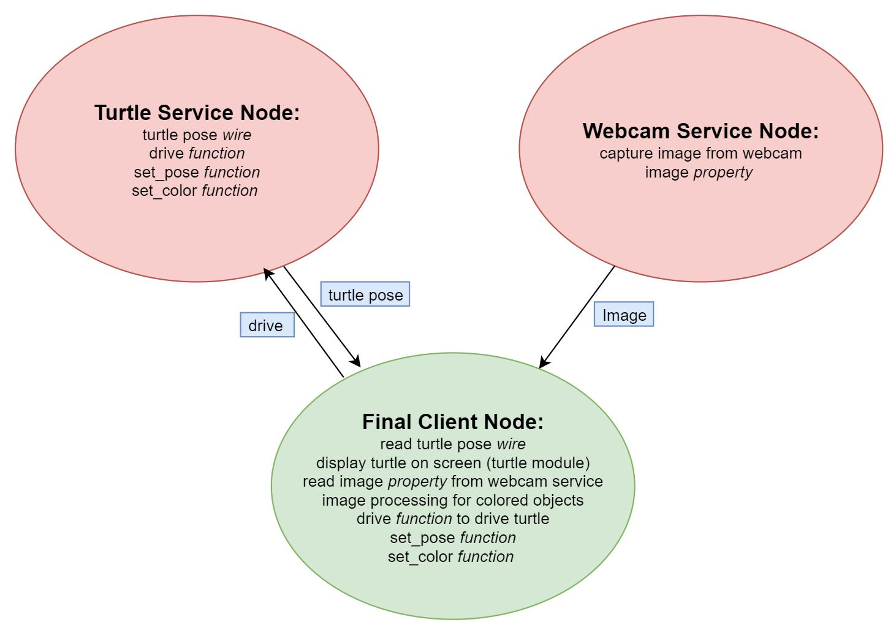

# Robot Raconteur Survey
Robot Raconteur is an object oriented Service-Client middleware. An RR service generally runs with a hardware (e.g. sensors,actuators) attached to a robot/computer to have direct communication between them. An RR client can receive messages that are sent from services and can call object functions in the service to command the robot. 

The goal for this trial is to create python turtle service and client, along with a given webcam service to control the on screen turtle based on different color the webcam sees.

In this example, we'll go through how RR webcam streaming works. **Please time yourself for each checkpoint.**
## RR Resources:
* RR Website: https://www.robotraconteur.com/
* RR Framework: https://robotraconteur.github.io/robotraconteur/doc/core/latest/cpp/index.html
* RR Python Examples: https://github.com/robotraconteur/RobotRaconteur_Python_Examples
## Outline
### Service Definition
* [Webcam Service Definition](#webcam-example-service-definition)
* [Turtlebot Service Definition](#create-turtlebot-service-definition)
### RR Service
* [Webcam Example Service](#webcam-example-service)
* [Turtlebot Service](#create-turtlebot-service)
### RR Client
* [Webcam Streaming Client](#webcam-example-streaming-client)
* [Simple Turtlebot Client](#create-simple-turtlebot-client)


# Service Definition
Each RR service has its own service definition file, which includes properties, functions and others that are exposed to clients. In other words, the definition inside the `.robdef` file are the ones the client has access to. 
## Webcam Example Service Definition
Let's take a look at the webcam example service definition `~/python_turtle_trial/RR/robdef/experimental.createwebcam2.robdef` below:
```
service experimental.createwebcam2

stdver 0.9

struct WebcamImage
    field int32 width
    field int32 height
    field int32 step
    field uint8[] data
end

object Webcam
    property WebcamImage image
end
```
First there's a struct for `WebcamImage`, consisting of `width, height, step and data`. The first three elements are the metadata of an image, and the `data` contains the actual pixel information as an 1-D array.
The object that being exposed to the network has the `object` keyword, and in this case it's the `Webcam`. The object in the example only has one member, a property of `WebcamImage` with name `image`. `Property` type is only one value type in RR, in the task below we'll introduce `wire` type, which is a good fit for constantly changing data.

## Create Turtlebot Service Definition
Now let's try create the service definition for a turtlebot:
```
service experimental.turtlebot_create

stdver 0.9

struct pose
    field double x
    field double y
    field double angle
end


object turtlesim
	function void drive(double move_speed, double turn_speed)
	function void setpose(pose turtle_pose)
	wire pose turtle_pose_wire [readonly]
	property string color

end object
```
With provided service definition above, create a file `experimental.turtlebot_create.robdef` under `~/python_turtle_trial/RR/robdef` and copy them into the file as your service definition file. Feel free to modify it later. This service definition will give you a sense on what object information to contain in your RR service later.

# RR Service
## Webcam Example Service
Inside `~/python_turtle_trial/RR`, there's `webcam_service.py` python script for RR webcam service. This example continuously capturing images from a webcam.
At very top, the RobotRaconteur library is imported:
```
import RobotRaconteur as RR
RRN=RR.RobotRaconteurNode.s
```
The class `Webcam_impl(object)` is the python object that will be used for RR, but not all of its members are members in service definition. The only member in the service definition, `image`, is defined upon initializaiton:
```
self.image=RRN.NewStructure("experimental.createwebcam2.WebcamImage")
```
Other parts in the class are mostly for continuously streaming of the webcam. Inside `CaptureFrame()` function, the image data is read inside the while loop and formed into the struct defined in service definition:
```
ret, frame=self._capture.read()
if not ret:
    raise Exception("Could not read from webcam")
self.image.width=frame.shape[1]
self.image.height=frame.shape[0]
self.image.step=frame.shape[1]*3
self.image.data=frame.reshape(frame.size, order='C')
```
Now take a look at the main function, the node name and port number is specified in the following line:
```
with RR.ServerNodeSetup("Webcam_Service",2355) as node_setup:
```
In this case, the node name is "Webcam_Service" and the port is 2355 (arbirary defined, as long as not used by other applications).
The service definition file is registered right after that:
```
RRN.RegisterServiceTypeFromFile("robdef/experimental.createwebcam2")
```
Then the object is created and the service is registered:
```
c1=Webcam_impl()
RRN.RegisterService("Webcam","experimental.createwebcam2.Webcam",c1)
```
The service is registered with name "Webcam", type of "experimental.createwebcam2.Webcam", actual object of c1

The `input()` function at last holds the script from exiting. To run this script, simply run `$ python webcam_service.py`.

* **Checkpoint 1**: 
The terminal should print "Press Enter to quit" after running the service. Please direct to `Robotics_Middleware_Trial_Python_Turtle/readme.md` for question post.

## Create Turtlebot Service
Now let's create an RR service for the turtlebot. Create a new file and name it `turtlebot_service.py`. First import the RR and other essential libraries at top:
```
import numpy as np
import RobotRaconteur as RR
RRN=RR.RobotRaconteurNode.s
```
Then create a class `create_turtle`, and fill in according to the service definition:
```
class create_turtle:
	def __init__(self):               			#initialization upon creation
		#RR property
		self.turtle_pose=<RR structure of pose>		#create RR structure obj
		self.color="None"
	def drive(self,move_speed,turn_speed):            #Drive function, update new position, this is the one referred in definition
		#assign those values
		self.turtle_pose.x=<integrate speed>			
		self.turtle_pose.y=<integrate speed>
		self.turtle_pose.angle=<integrate speed>
		#update wire value
		self.turtle_pose_wire.OutValue=self.turtle_pose
	def setpose(self,turtle_pose):			  #Setpose function, change the pose of turtle directly
		self.turtle_pose=<update pose>
		#update wire value
		self.turtle_pose_wire.OutValue=self.turtle_pose
```
After creating the class object, it's necessary to intialize an RR node as well as registering the service like in *Webcam Example*:
```
with RR.ServerNodeSetup(<service definition name>, <port number>):      #setup RR node with service name and port
	#Register the service type
	RRN.RegisterServiceTypeFromFile(<service definition file>)               #register service type

	create_inst=<create class object>                #create object

	#Register the service with definition and object
	RRN.RegisterService(<service name>,<service definition object>,<object to be passed>)

	#Wait for program exit to quit
	input("Press enter to quit")
```
	
By filling in the sections above, an RR turtlebot service is ready to run by `$ python turtlebot_service.py`!

* **Checkpoint 2**:
The terminal should print "Press enter to quit" after running the service without any error. Please direct to `Robotics_Middleware_Trial_Python_Turtle/readme.md` for question post.

# RR Client
## Webcam Example Streaming Client
There's script `streaming_client.py` under `~/python_turtle_trial/RR`. The RR client library is imported at the top:
```
from RobotRaconteur.Client import *
```
The function `WebcamImageToMat(image)` converts RR image property to openCV object. Inside main function, the `url` is the string containing the IP address of the service, the port the service is on and the service name. The default url in script is
```
url='rr+tcp://localhost:2355/?service=Webcam'
```
But it's possible to use command line options to provide the url:
```
$ python streaming_client.py rr+tcp://localhost:2355/?service=Webcam
```

,where `localhost` means the service is running on this local machine.
```
cam_sub=RRN.SubscribeService(url)
cam_obj=cam_sub.GetDefaultClientWait(5)
```
`cam_sub` is the subscription object of Robot Raconteur, subscribing to the given url. `cam_obj` is the object returned from the service side, and it should contain the member defined in the service definition, which is the `image` property. And the image is accessed and converted to openCV object by
```
WebcamImageToMat(cam_obj.image)
```
To run this script, simply do `$ python streaming_client.py`.

* **Checkpoint 3**:
The popup window should display the real time image from webcam. Please direct to `Robotics_Middleware_Trial_Python_Turtle/readme.md` for question post.


## Create Simple Turtlebot Client
Now let's create a simple RR client for the turtlebot. Create a new file and name it `turtlebot_client.py`. First import the RR and other essential libraries at top:
```
from RobotRaconteur.Client import *     #import RR client library
import turtle
```
Similar to the `turtlebot.py`, we need to initialize the screen and a turtle first:
```
#display setup
screen = turtle.Screen()
screen.bgcolor("lightblue")
#turtle setup
t1=turtle.Turtle()
t1.shape("turtle")
```
After that, it's necessary to have an `update` function to update the display:
```
def update(turtle_obj,turtle_pose_wire):                    	#Update the display
        if turtle_obj.color=="None":		#update pen color on display
            t1.penup()
        else:
            t1.pencolor(turtle_obj.color)

	t1.setpos(turtle_pose_wire.InValue.x,turtle_pose_wire.InValue.y)
	t1.seth(turtle_pose_wire.InValue.angle)
```
Then comes the RR part, we intialize the RR client node:
```
url='rr+tcp://localhost:<port number>/?service=<service name>'
#take url from command line
if (len(sys.argv)>=2):
	url=sys.argv[1]
```
Since we have a `wire` in our service definition, it's better to use the subscriber mode here;
```
sub=RRN.SubscribeService(url)
turtle_obj = sub.GetDefaultClientWait(5)		#wait for 5 seconds timeout if no object returned
turtle_pose_wire=sub.SubscribeWire(<wire name>)		#subscribe to the wire name

```

A good example would be having the turtle driving a circle:
```
while True:
	turtle_obj.drive(10,10)
	update(turtle_obj, turtle_pose_wire)		#update in display
```
Make sure the service has already started, and then run this client by `python turtlebot_client.py`

* **Checkpoint 4**:
There'll be a popup window with blue background and display the turtle running in circle. Please direct to `Robotics_Middleware_Trial_Python_Turtle/readme.md` for question post.


# Task
## 1
From the tutorial above, you should have a complete turtlebot service and a simple turtlebot client. Given the example of reading keyboard inputs under `~/python_turtle_trial/Examples`, copy it to `~/python_turtle_trial/RR` and try adapting it into an RR client that can control the turtle through keyboard.
* **Checkpoint 5**:
In the terminal running keyboard client, pressing the arrow keys will make the turtle in the window move accordingly. Please direct to `Robotics_Middleware_Trial_Python_Turtle/readme.md` for question post.


## 2

The final goal is to create a service-client model above, with the turtle service keeps track of the state of the turtle, the webcam captures image continuously and expose them to client, the client display the turtle with python turtle module and command the turtle based on image content. The webcam service is provided and the turtle service is created through tutorial.

Given the detection example `Examples/detection.py`, create the final client reading in images from the webcam service, process the image and drive the turtle based on the color detected in your webcam as well as setting the color of the turtle to color detected.

* **Checkpoint 6**:
By pointing the webcam at different section of the [color wheel](https://commons.wikimedia.org/wiki/File:RGB_color_wheel_360.svg), the turtle on screen should drive based on the color seen. Please direct to `Robotics_Middleware_Trial_Python_Turtle/readme.md` for question post.


